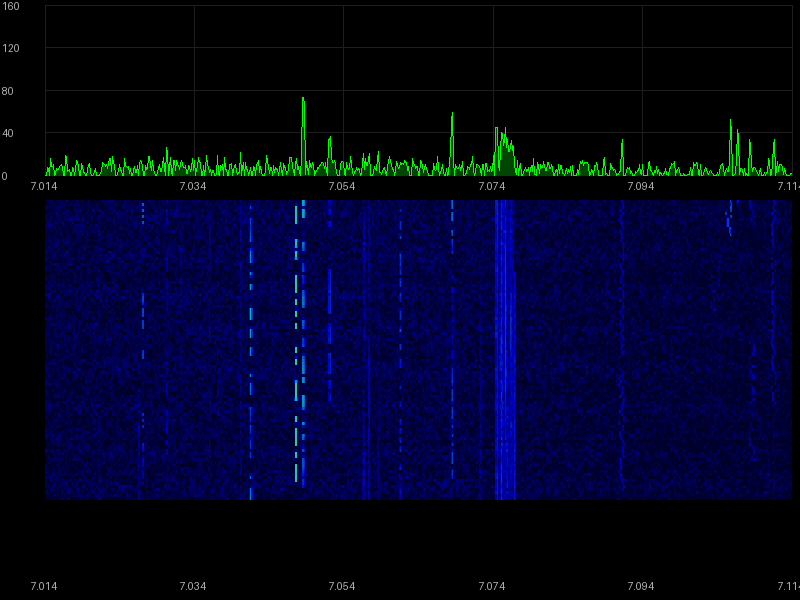

# icom-lan

[](https://www.python.org/downloads/)
[](LICENSE)
[](#testing)
[](#testing)
[](#testing)

**Python library for controlling Icom transceivers over LAN (UDP) or USB serial.**

Direct connection to your radio — no wfview, hamlib, or RS-BA1 required.

## Features

- ✅ **100% CI-V command coverage** — all 134 IC-7610 commands implemented (Epic #140, 2026-03-07)
- 🗂️ **Data-driven rig profiles** — add new radio support by writing a `.toml` file, no Python required ([guide](https://morozsm.github.io/icom-lan/guide/rig-profiles/))
- 📡 **Direct UDP connection** — LAN backend (UDP ports 50001/2/3), no intermediate software needed
- 🔌 **USB serial backend** — IC-7610 and IC-7300 USB CI-V + USB audio devices ([setup guide](https://morozsm.github.io/icom-lan/guide/ic7610-usb-setup/)); **automatic USB audio device resolution** for multi-radio setups via macOS IORegistry topology matching
- 🎛️ **Full CI-V command set** — frequency, mode, filter, power, meters, PTT, CW keying, VFO, split, ATT, PREAMP
- 🔍 **Unified discovery** — find radios on LAN and USB serial ports, deduplicated by identity
- 💻 **CLI tool** — `icom-lan status`, `icom-lan freq 14.074m`
- ⚡ **Async API** — built on asyncio for seamless integration
- 🚀 **Fast non-audio connect path** — CLI/status calls don't block on audio-port negotiation
- 🧠 **Commander queue** — wfview-style serialized command execution with pacing, retries, and dedupe
- 📊 **Scope/waterfall** — real-time spectrum data with callback API
- 🌐 **Built-in Web UI** — spectrum, waterfall, controls, meters, and audio in your browser (`icom-lan web`):
  - 🎛️ **Dual-receiver display** — MAIN and SUB receiver state (IC-7610)
  - 📻 **Band selector** — one-click band buttons (160m–10m)
  - 🔊 **Browser audio TX** — transmit from your microphone via Opus codec
  - 🎚️ **Full control panel** — AF/RF/Squelch sliders, NB/NR/DIGI-SEL/IP+ toggles, ATT/Preamp, VFO A/B
  - 📊 **Meters** — S-meter, SWR (color-coded), ALC, Power, Vd, Id
  - 🔄 **Live state sync** — HTTP polling at 200ms, no page refresh needed
- 🔊 **Virtual audio bridge** — route radio audio to BlackHole/Loopback for WSJT-X, fldigi, JS8Call (`icom-lan web --bridge "BlackHole 2ch"`)
- 📡 **DX cluster integration** — real-time spot overlays on the waterfall with click-to-tune (`icom-lan web --dx-cluster dxc.nc7j.com:7373 --callsign KN4KYD`)
- 🔌 **Hamlib NET rigctld server** — drop-in replacement for `rigctld`, works with WSJT-X, JS8Call, fldigi
- 🎛️ **Dual-receiver support** — MAIN/SUB via Command29 (IC-7610)
- 📊 **Audio FFT Scope** — real-time FFT on USB/LAN audio for radios without hardware spectrum (Yaesu FTX-1, etc.)
- 🖥️ **LCD display mode** — Web UI shows LCD-style layout for radios without a hardware scope
- 📡 **UDP relay proxy** — remote access via VPN/Tailscale
- 🔒 **Zero dependencies** — pure Python, stdlib only
- 📝 **Type-annotated** — full `py.typed` support

## Supported Radios

| Radio | Protocol | LAN | USB Serial | Notes |
|-------|----------|-----|------------|-------|
| **IC-7610** | CI-V `0x98` | ✅ Tested | ✅ Tested | Dual receiver (MAIN/SUB) |
| **IC-7300** | CI-V `0x94` | — | ✅ Tested | Single receiver (VFO A/B), USB-only |
| **Yaesu FTX-1** | Yaesu CAT | — | ✅ Tested | 17 modes, VHF/UHF, C4FM, Audio FFT Scope |
| **Xiegu X6100** | CI-V `0x70` | — | Profile only | IC-705 compatible, QRP 8W, WiFi |
| **Lab599 TX-500** | Kenwood CAT | — | Profile only | QRP 10W, minimal CAT |
| IC-705 | CI-V `0xA4` | — | — | WiFi, should work |
| IC-9700 | CI-V `0xA2` | — | — | VHF/UHF/SHF |
| IC-7851 | CI-V `0x8E` | — | — | |
| IC-R8600 | CI-V `0x96` | — | — | RX only |

Radio capabilities are defined in `rigs/*.toml` — see [Adding a New Radio](https://morozsm.github.io/icom-lan/guide/rig-profiles/) for how to add support for untested models. Three protocol types supported: CI-V (Icom binary), Kenwood CAT (text), and Yaesu CAT (text).

**USB Serial Backend**: Tested with IC-7610 and IC-7300. See [IC-7610 USB Serial Backend Setup Guide](https://morozsm.github.io/icom-lan/guide/ic7610-usb-setup/) for setup instructions.

## Installation

```bash
pip install icom-lan
```

From source:

```bash
git clone https://github.com/morozsm/icom-lan.git
cd icom-lan
pip install -e .
```

## Quick Start

### Python API

The recommended way to connect is **`create_radio`** with a backend config (LAN or serial). You get a **`Radio`** instance that works the same regardless of backend:

```python
import asyncio
from icom_lan import create_radio, LanBackendConfig

async def main():
    config = LanBackendConfig(
        host="192.168.1.100",
        username="user",
        password="pass",
    )
    async with create_radio(config) as radio:
        # Read current state
        freq = await radio.get_frequency()
        mode, _ = await radio.get_mode()
        s = await radio.get_s_meter()
        print(f"{freq/1e6:.3f} MHz  {mode}  S={s}")

        # Tune to 20m FT8
        await radio.set_frequency(14_074_000)
        await radio.set_mode("USB")

        # VFO & Split
        await radio.select_vfo("MAIN")
        await radio.set_split_mode(True)

        # CW
        await radio.send_cw_text("CQ CQ DE KN4KYD K")

        # Scope / Waterfall (if radio supports it)
        def on_frame(frame):
            print(f"{frame.start_freq_hz/1e6:.3f}–{frame.end_freq_hz/1e6:.3f} MHz, {len(frame.pixels)} px")
        radio.on_scope_data(on_frame)
        await radio.enable_scope()

asyncio.run(main())
```

**Legacy:** For direct LAN-only code you can still use `IcomRadio(host, username=..., password=...)` — see [Public API Surface](https://morozsm.github.io/icom-lan/api/public-api-surface/) and [API Reference](https://morozsm.github.io/icom-lan/api/radio/).

### CLI

```bash
# Set credentials via environment
export ICOM_HOST=192.168.1.100
export ICOM_USER=myuser
export ICOM_PASS=mypass

# Radio status
icom-lan status

# Frequency (multiple input formats)
icom-lan freq             # Get
icom-lan freq 14.074m     # Set (MHz)
icom-lan freq 7074k       # Set (kHz)
icom-lan freq 14074000    # Set (Hz)

# Mode
icom-lan mode USB

# Meters (JSON output)
icom-lan meter --json

# CW keying
icom-lan cw "CQ CQ DE KN4KYD K"

# PTT
icom-lan ptt on
icom-lan ptt off

# Attenuator & Preamp (Command29-aware for IC-7610)
icom-lan att              # Get attenuation level
icom-lan att 18           # Set 18 dB
icom-lan preamp           # Get preamp level
icom-lan preamp 1         # Set PREAMP 1

# Scope / Waterfall snapshot (requires: pip install icom-lan[scope])
icom-lan scope                      # Combined spectrum + waterfall → scope.png
icom-lan scope --spectrum-only      # Spectrum only (1 frame)
icom-lan scope --theme grayscale    # Grayscale theme
icom-lan scope --json               # Raw data as JSON (no Pillow needed)

# Example output


# Remote power on/off
icom-lan power-on
icom-lan power-off

# UDP relay proxy (for VPN/Tailscale remote access)
icom-lan proxy --radio 192.168.55.40 --port 50001

# Discover radios on LAN + USB serial (unified, deduped)
icom-lan discover

# Built-in Web UI (spectrum, waterfall, controls, audio)
icom-lan web                            # Start on 0.0.0.0:8080
icom-lan web --port 9090                # Custom port
# Then open http://your-ip:8080 in a browser

# Hamlib NET rigctld-compatible server (use with WSJT-X, JS8Call, fldigi)
icom-lan serve                          # Listen on 0.0.0.0:4532
icom-lan serve --port 4532 --read-only  # Read-only mode (no TX control)
icom-lan serve --max-clients 5          # Limit concurrent clients
icom-lan serve --wsjtx-compat           # Pre-warm DATA mode for WSJT-X CAT/PTT flow

# Then in WSJT-X: Rig → Hamlib NET rigctl, Address: localhost, Port: 4532

# All-in-one: Web UI + audio bridge + rigctld
icom-lan web --bridge "BlackHole 2ch"
# Now WSJT-X gets: CAT via rigctld (:4532) + audio via BlackHole

# List available audio devices
icom-lan audio bridge --list-devices

# Audio bridge only (no web UI)
icom-lan audio bridge --device "BlackHole 2ch"
icom-lan audio bridge --device "BlackHole 2ch" --rx-only
```

## API Reference

The main entry point is **`create_radio(config)`** returning a **`Radio`** (see [Public API Surface](https://morozsm.github.io/icom-lan/api/public-api-surface/)). For LAN-only usage, **`IcomRadio`** remains available as a legacy class with the same methods.

### Radio methods (create_radio / IcomRadio)

| Method | Description |
|--------|-------------|
| `get_frequency()` → `int` | Current frequency in Hz |
| `set_frequency(hz)` | Set frequency |
| `get_mode()` → `(str, filter \| None)` | Current mode name + filter number (if reported) |
| `get_mode_info()` → `(Mode, filter)` | Current mode + filter number (if reported) |
| `set_mode(mode, filter_width=None)` | Set mode (optionally with filter 1-3) |
| `get_filter()` / `set_filter(n)` | Read/set filter number |
| `get_power()` → `int` | RF power level (0–255) |
| `set_power(level)` | Set RF power |
| `get_s_meter()` → `int` | S-meter (0–255) |
| `get_swr()` → `int` | SWR meter (0–255, TX only) |
| `get_alc()` → `int` | ALC meter (0–255, TX only) |
| `set_ptt(on)` | Push-to-talk on/off |
| `select_vfo(vfo)` | Select VFO (A/B/MAIN/SUB) |
| `set_split_mode(on)` | Split on/off |
| `get_attenuator_level(receiver)` → `int` | Read attenuator in dB (Command29) |
| `set_attenuator_level(db, receiver)` | Set attenuator dB (0–45, 3 dB steps) |
| `get_preamp(receiver)` → `int` | Read preamp level (Command29) |
| `set_preamp(level, receiver)` | Set preamp (0=off, 1=PRE1, 2=PRE2) |
| `on_scope_data(callback)` | Register callback for scope/waterfall frames |
| `enable_scope(output=True)` | Enable scope display + data output |
| `disable_scope()` | Disable scope data output |
| `send_cw_text(text)` / `stop_cw_text()` | Send/stop CW via built-in keyer |
| `power_control(on)` | Remote power on/off |
| `snapshot_state()` / `restore_state(state)` | Best-effort state save/restore |
| `send_civ(cmd, sub, data)` | Send raw CI-V command |
| `get_nb(receiver)` / `set_nb(on, receiver)` | Noise Blanker on/off (Command29) |
| `get_nr(receiver)` / `set_nr(on, receiver)` | Noise Reduction on/off (Command29) |
| `get_digisel(receiver)` / `set_digisel(on, receiver)` | DIGI-SEL on/off (Command29) |
| `get_ip_plus(receiver)` / `set_ip_plus(on, receiver)` | IP+ on/off (Command29) |
| `get_data_mode()` / `set_data_mode(on)` | DATA mode on/off |
| `get_af_level(receiver)` / `set_af_level(level, receiver)` | AF gain level (0-255, Command29) |
| `get_rf_gain(receiver)` / `set_rf_gain(level, receiver)` | RF gain level (0-255, Command29) |
| `set_squelch(level, receiver)` | Squelch level (0-255, Command29) |
| `start_audio_rx()` / `stop_audio_rx()` | Start/stop RX audio stream |
| `start_audio_tx()` / `stop_audio_tx()` | Start/stop TX audio stream |
| `push_audio_tx_opus(data)` | Push Opus audio frames for TX |
| `audio_bus` | AudioBus pub/sub for multi-consumer audio distribution |
| `vfo_exchange()` | Exchange VFO A↔B frequencies |
| `vfo_equalize()` | Copy active VFO to inactive |

### HTTP Endpoints

| Endpoint | Description |
|----------|-------------|
| `GET /api/v1/state` | Dual-receiver state JSON (MAIN+SUB) |
| `GET /api/v1/bridge` | Audio bridge status |
| `POST /api/v1/bridge` | Start audio bridge |
| `DELETE /api/v1/bridge` | Stop audio bridge |

### Configuration

| Parameter | Default | Env Var | Description |
|-----------|---------|---------|-------------|
| `host` | — | `ICOM_HOST` | Radio IP address |
| `port` | `50001` | `ICOM_PORT` | Control port |
| `username` | `""` | `ICOM_USER` | Auth username |
| `password` | `""` | `ICOM_PASS` | Auth password |
| `radio_addr` | `0x98` | — | CI-V address |
| `timeout` | `5.0` | — | Timeout (seconds) |

## How It Works

The library implements the Icom proprietary LAN protocol:

1. **Control port** (50001) — UDP handshake, authentication, session management
2. **CI-V port** (50002) — CI-V command exchange
3. **Audio port** (50003) — RX/TX audio streaming (including full-duplex orchestration)

```
Discovery → Login → Token → Conninfo → CI-V Open → Commands
```

See the [protocol documentation](https://morozsm.github.io/icom-lan/internals/protocol/) for a deep dive.

## Multi-Radio Architecture

icom-lan uses an abstract **Radio Protocol** that enables support for multiple radio backends with a single Web UI and API.

```
┌──────────────────────────────────────────────┐
│          Web UI  /  rigctld  /  CLI           │
├──────────────────────────────────────────────┤
│          Radio Protocol (core)                │
│  ┌──────────────┬─────────────┬────────────┐ │
│  │ AudioCapable │ ScopeCapable│ DualRxCap. │ │
│  └──────────────┴─────────────┴────────────┘ │
├────────┬──────────┬──────────┬───────────────┤
│IcomLAN │IcomSerial│ YaesuCAT │  Future...    │
└────────┴──────────┴──────────┴───────────────┘
```

- **`Radio`** — core protocol: freq, mode, PTT, meters, power, levels
- **`AudioCapable`** — audio streaming (LAN or USB audio device)
- **`ScopeCapable`** — spectrum/panadapter data
- **`DualReceiverCapable`** — dual independent receivers (IC-7610 Main/Sub)

📖 **Full protocol docs:** [Radio Protocol](docs/radio-protocol.md)

## Development

### Quick Start (Development Server)

```bash
./run-dev.sh
```

Starts the web server with:
- `ICOM_DEBUG=1` — DEBUG level logging to console + file
- Logs: `logs/icom-lan.log`
- Radio: `192.168.55.40` (override with `ICOM_HOST=...`)
- Web UI: `http://0.0.0.0:8080`

### Debug Logging

```bash
# Enable debug logging (logs to logs/icom-lan.log)
ICOM_DEBUG=1 uv run icom-lan web --host 0.0.0.0 --port 8080

# Custom log file
ICOM_DEBUG=1 ICOM_LOG_FILE=/tmp/debug.log uv run icom-lan web

# Console only (no file)
ICOM_DEBUG=1 ICOM_LOG_FILE= uv run icom-lan web
```

**Server crashed?** Check `logs/icom-lan.log` for traceback.

### Environment Variables

| Variable | Default | Description |
|----------|---------|-------------|
| `ICOM_DEBUG` | `0` | Set to `1` for DEBUG logging + file output |
| `ICOM_LOG_FILE` | `logs/icom-lan.log` | Log file path (auto-created in DEBUG mode) |
| `ICOM_HOST` | `192.168.55.40` | Radio IP address |
| `ICOM_USER` | `moroz` | Radio username |
| `ICOM_PASS` | — | Radio password |
| `ICOM_AUDIO_SAMPLE_RATE` | `48000` | Default PCM sample rate in Hz — must be one of 8000, 16000, 24000, 48000 |
| `ICOM_AUDIO_BUFFER_POOL_SIZE` | `5` | Pre-allocated audio buffer pool size in the broadcaster |
| `ICOM_AUDIO_BROADCASTER_HIGH_WATERMARK` | `10` | Max queued frames in the broadcaster before dropping (per-client queue) |
| `ICOM_AUDIO_CLIENT_HIGH_WATERMARK` | `10` | Max queued audio frames per WebSocket client before dropping |

#### Tuning for High-Latency Links (VPN, Cloud VMs)

On constrained links — e.g. a cloud VM behind WireGuard or Tailscale — the default
audio parameters can cause CI-V queue overflow and audio glitches. The following values
have been validated on a 1/8 OCPU Oracle Free Tier VM with ~60 ms WireGuard RTT:

```env
# Lower sample rate reduces bandwidth: 48 kHz ≈ 768 kbps → 16 kHz ≈ 256 kbps
ICOM_AUDIO_SAMPLE_RATE=16000

# Larger pool prevents GC pauses from buffer exhaustion
ICOM_AUDIO_BUFFER_POOL_SIZE=15

# Higher watermarks absorb tunnel jitter spikes (~500 ms at 20 ms/frame)
ICOM_AUDIO_BROADCASTER_HIGH_WATERMARK=25
ICOM_AUDIO_CLIENT_HIGH_WATERMARK=25
```

These defaults are intentionally conservative for local LAN use. Increase them only
when you observe CI-V queue overflow warnings in the logs.

*Thanks to Leon Toorenburg (WW0R, Nederland CO) for reporting and testing these
parameters while running icom-lan remotely over WireGuard to his IC-7610.*

## Testing

```bash
# Unit tests (no radio required) — 3929 tests, 95% coverage
pytest tests/test_*.py

# Mock integration tests (full UDP protocol, no radio required)
pytest tests/test_mock_integration.py

# Integration tests (real radio required)
export ICOM_HOST=192.168.55.40
export ICOM_USER=your_username
export ICOM_PASS=your_password
pytest -m integration tests/integration

# Guarded power-cycle test (will actually power off/on radio)
export ICOM_ALLOW_POWER_CONTROL=1
pytest -m integration tests/integration/test_radio_integration.py::TestPowerHardware::test_power_cycle_roundtrip -q -s

# Soak test (seconds)
export ICOM_SOAK_SECONDS=120
pytest -m integration tests/integration/test_radio_integration.py::TestSoak::test_soak_retries_and_logging -q -s
```

### Test Suite Quality

- **3929 tests** (3929 passed, 56 skipped) across unit, integration, and mock-integration suites
- **95% code coverage** — comprehensive protocol and runtime coverage
- **0 mypy errors** — full type safety with protocol-based architecture
- **Epic #140 complete** — 100% CI-V command coverage (134/134 commands)
- **Epic #215 complete** — post-audit cleanup: type safety, dead code removal, API surface definition

## Documentation

📖 **Full documentation:** [morozsm.github.io/icom-lan](https://morozsm.github.io/icom-lan)

- [Getting Started](https://morozsm.github.io/icom-lan/guide/quickstart/)
- [CLI Reference](https://morozsm.github.io/icom-lan/guide/cli/)
- [Public API Surface](https://morozsm.github.io/icom-lan/api/public-api-surface/) — recommended `create_radio` + `Radio`
- [API Reference](https://morozsm.github.io/icom-lan/api/radio/)
- [Protocol Internals](https://morozsm.github.io/icom-lan/internals/protocol/)
- [Security](https://morozsm.github.io/icom-lan/SECURITY/)

## Security

- Zero external dependencies — minimal attack surface
- Credentials passed via env vars or parameters, never stored
- The Icom protocol uses UDP without encryption — see [SECURITY.md](docs/SECURITY.md)

## License

MIT — see [LICENSE](LICENSE).

Protocol knowledge based on [wfview](https://wfview.org/) (GPLv3) reverse engineering. This is an independent clean-room implementation, not a derivative work.

## Acknowledgments

- The [wfview](https://wfview.org/) project for their extensive reverse engineering of the Icom LAN protocol
- The amateur radio community for testing and feedback

## Trademark Notice

Icom™ and the Icom logo are registered trademarks of [Icom Incorporated](https://www.icomjapan.com/). This project is not affiliated with, endorsed by, or sponsored by Icom. Product names are used solely for identification and compatibility purposes (nominative fair use).

---

73 de KN4KYD 🏗️


## Project Scope

`icom-lan` remains the public MIT-licensed open core for radio control, transport, protocol support, and local-first tooling.

Some future product planning, commercial exploration, or private implementation work may happen outside this repository in separate private repositories. That separation is intentional and does not change the open-source status of `icom-lan` itself.

Public improvements that strengthen the core project may still be contributed here when appropriate.

